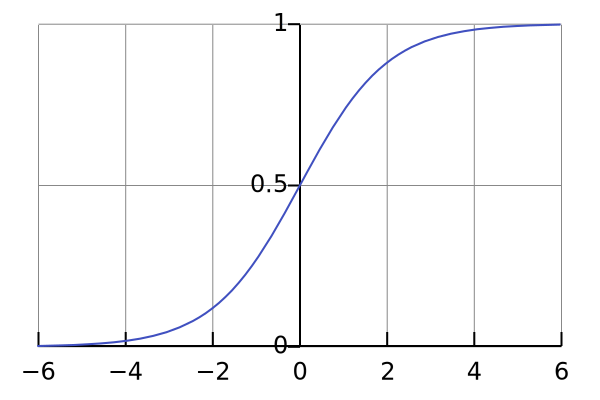

Prev @ `motivations.md`
# So writing code
Geez. A lot of the previous conversation was about _what_ learning is.

```py
# inspired from /primitive/v0

class Neuron:
    input_1
    input_2
    input_n

    def __init__(self, *args, **kwargs):
        # do whatever initialization

    def predict(self):
        return self.black_box_operations()
```

So what exactly is `black_box_operations()`?

Let's say our `Neuron` is just taking an input, and giving an output. So the neuron is surprisingly
> y = mx + c
Huh. so `y = f(x)`.

Why? Why not just `mx` or just `c`. Well, you could set those to `0` within the neuron.

So if our "learning" was just `Input` -> `Neuron` -> `Output` multiple times, there's a subtle thing math tells us
> A Linear Transformation of several Linear Transformations is.. dissapointingly a Linear Transformation itself.

This is very dissapointing because... let's talk about an example: Parity. n-bit parity.

n-bit parity changes it's outcome for every bit flip, so if you talk about 2 bit parity:
```
00 -> 0
01 -> 1
10 -> 1
11 -> 0
(Parity is just a XOR of XORs and so on if you talk about it in the features we find out as humans.)
```

I'd argue a single linear function(i.e a line) cannot "reason" why `00` gives a `0` and why `11` also gives a `0`.
I can prove this very simply
```
y = f(x) = mx + c
2 unknowns.
We have 2 inputs

f(00) = 0 : c = 0
f(11) = 0 : m = 0
so this tells you f(x) = 0

or if you approach it via 01 and 10
f(01) = 1; so m + c = 1
f(10) = 1; so 10m + c = 1
so this tells you f(x) = 1
```
Hmm.

One obviously glaring issue with this is; How do you even consume a bit-type input here? I might be wrong. (I am.)
So linearity of a LT where y = f(x) is not a valid model we can move with.
So let's say mathematics _is_ right, even though my way of arriving at the conclusion is _very_ wrong.

The next obvious thing that came to me was:
> Hmm. Okay `y = f(x)` is useless where `f(x) = mx + c` because it doesn't give you enough playing room to learn.
> How does `y = f(x1,x2,x3,x4, ... xn)` sound?
> so y = m1\*x1 + m2\*x2 + m3\*x3 ... mn\*xn + b
> Why b? Let's say it's redundant, and if it truly is, it'll become b = 0 finally. (Sometimes it does!)
>

Let's say you've heard about "ML" before, you would've heard of a "squishification". Why?
Because at it's core, even `y = f(x1,x2,x3,x4, ... xn)` is also a  LT.
Okay so you can squish it in multiple ways, why do we choose one specific way(This has some interesting answers later @ `v3.md`)
There's no right answer before building an intuition for what a neuron is.
Let's assume you're using some function `s(input) = output` to squish.
Well you're manipulating the output by bending the input space in a way to provide abstract meaning of the input, so maybe, just maybe a neuron who consumes this neuron's output learns something.
> I think it's plenty clear that I am not approaching this from a mathematically rigourous explanation or is an accurate representation of reality, because I'm yet to read formal things. I'm just a guy who has a bunch of neurons who talk to each other and can figure out the MNIST number dataset with a ~96% accuracy with 0 dependencies.

<table>
<tr>
<td>



</td>
<td>

### Sigmoid. Let's squish things with sigmoid. Why?

I don't know. Maybe... sigmoid lets you be lazy.

If a neuron's output is very big or very small, the sigmoid pushes them to a `1` and `0` respectively.

Or.. as your output tends to "saturate", sigmoid becomes harsh(er). It damps you down into the [0, 1] space neatly.

However, if your neuron's output is in the middle and it's small in either direction.. the sigmoid is mild, it gives it a way to explore possible outcomes.

What if.. that is learning? Maybe. (It isn't, but maybe that makes us happy enough for now to move forward. )
later @ `v2.md`
</td>
</tr>
</table>

So. Inputs. LT. Sigmoid. Output? Basically
```
y = sigmoid(m1*x1 + m2*x2 + m3*x3 + ... + mn*xn + b)
```
This is _very_ similar to Matrix Dot Produtcs.
```
y = sigmoid(M * I + B)
```
One thing I would say is.. bias is also another `xn` type value, just that it has `mn = 1`, but let's mentally keep it seperate because it helps you tell a story about the neuron.